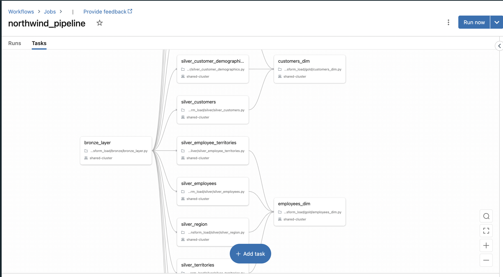
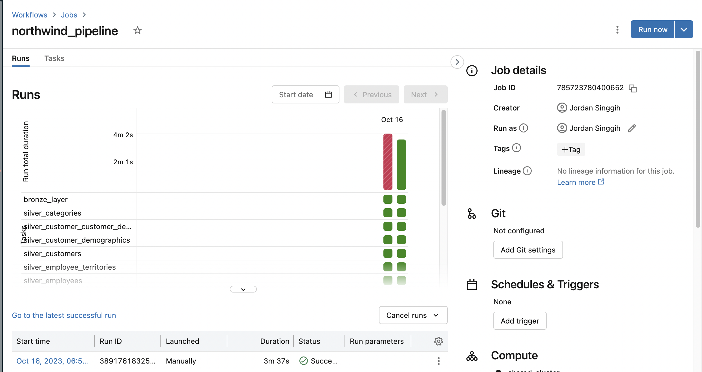
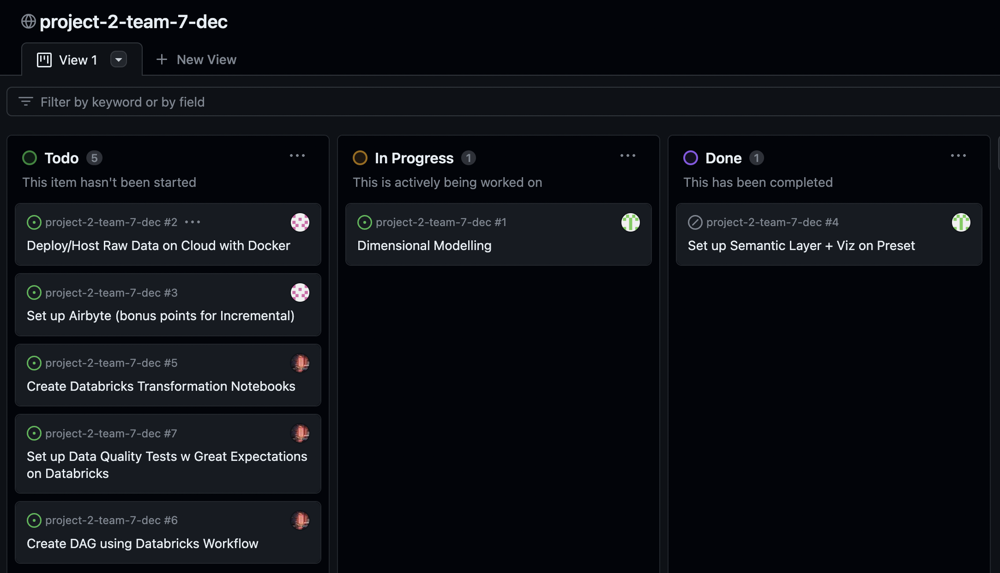

# project-1-team-7-dec
Repo for DEC Project 2

## Project Plan:

### 1. Objective:
The objective of our project was to create an ETL pipeline using the Northwind dataset (https://github.com/pthom/northwind_psql) to serve dimension and fact tables that would allow the analysts of a figurative Northwind company to:
1. Easily query information regarding products purchased for each transaction (i.e. transactions at the order_id-product_id level) through an `orders_fact` table,
2. Easily join the orders information with information regarding customers who placed the order, employees who shipped the order and the product purchased (through a `customers_dim` table, `employees_dim` table and `products_dim` table).

### 2. Consumers of Data:
The consumers of our data are the analysts that would like to be able to monitor products purchased for each order without having to do complicated joins, data cleaning and consistency checks (e.g. checking for valid datatypes/duplicates).
Additionally, they are analysts who would like to be able to get information for each order related to all relevant customer, employee and product information based on a given product ordered, without having to do so many joins.

### 3. Datasets:
Our team are using the Northwind dataset: (https://github.com/pthom/northwind_psql)

### 4. Business Process Modelling:
The business process being modelled in our project, is sales order processing (i.e. the transactions involving customer orders for products).
As such, the orders_fact table being served presents detailed information regarding each order (the products ordered, their quantities, their total pricing) and can be joined with the relevant dimensions to further track the employees handling the orders, which customers placed the orders as well as the shipping details involved.

These tables would therefore allow analysts to undertake analysis/visualise metrics regarding sales performance of given products, customer behaviour and fulfillment efficiencies.

## 5. Solution Architecture:

Our solution involves:
1. Data ingestion using Airbyte to extract data from PostgreSQL to Databricks Lakehouse.
2. Transform-Load using Databricks, where:
    - The Bronze layer is responsible for validating data types of ingested data form databricks, normalilsing data and enforcing data quality tests where relevant (using Great Expectations).
    - The Silver Layer is responsible for selecting the relevant columns from the Bronze layer tables and removing duplicated rows.
    - The Gold Layer is responsible for constructing the fact and dimensions tables.

The Transform-Load step was orchestrated using Databricks Workflow run on the cloud, as shown by the figures below:

## 6. Task Breakdown:

Tasks were broken down among team members using Github boards:

The tasks allocated were:
1. Setting up Airbyte data ingestion - Vivian
2. Creatig Transform-Load workflows using Databricks - Jordan
3. Dimensional Modelling and Data Visualization - Laura